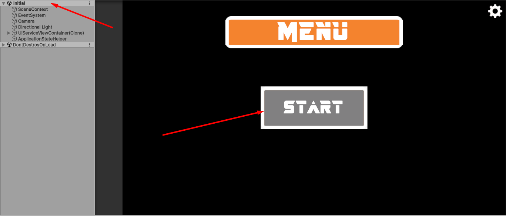
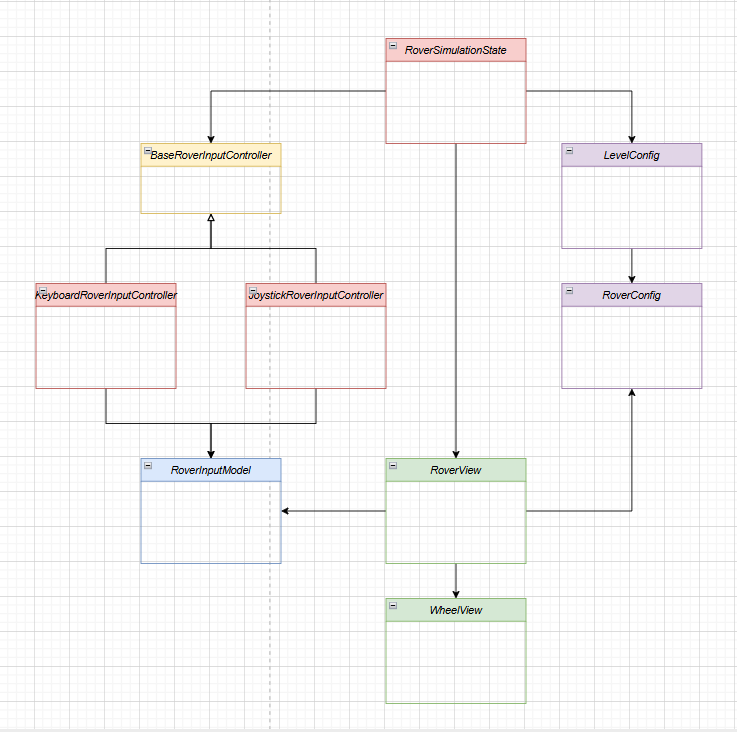
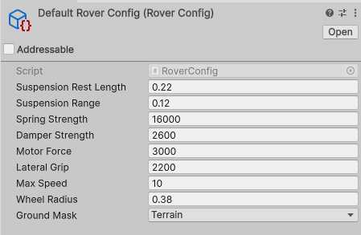
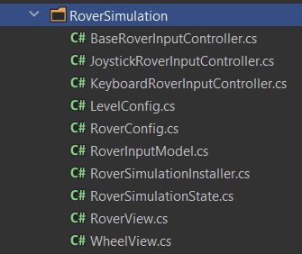

# 🚗 Rover Simulation

Проста симуляція 4-колісного **differential-drive ровера** на Unity.

- **Unity version: 6000.2.12f1**

## ✨ Можливості

- Рух вперед / назад
- Розворот на місці
- Поворот через differential drive
- Рух по схилах
- Подолання дрібних перешкод
- Підтримка різних джерел вводу

---

## 🎮 Старт симуляції

- перейти на сцену Initial (Editor)
- у меню натиснути кнопку Start



---

## 🧠 Архітектура

Проєкт побудований з розділенням відповідальності між input, model та physic(view).

### Основний потік

```text
Input → RoverInputModel → RoverView (Physics)
```

### Основні компоненти



#### `RoverSimulationState`
- Точка входу симуляції
- Керує життєвим циклом сцени
- Ініціалізує ровер та пов’язані залежності

#### `BaseRoverInputController`
Абстракція для системи вводу.

Реалізації:
- `KeyboardRoverInputController`
- `JoystickRoverInputController`

Це дозволяє легко змінювати джерело керування без зміни фізики ровера.

#### `RoverInputModel`
- Зберігає поточний стан вводу:
    - `Move`
    - `Turn`
- Є зв’язуючим шаром між input controller та фізикою

#### `RoverView`
Основний фізичний компонент, який відповідає за:
- підвіску
- тягу
- бокове зчеплення
- обмеження швидкості
- оновлення візуалу коліс

#### `WheelView`
Містить дані окремого колеса:
- точку контакту
- візуальне представлення
- тимчасові дані стану колеса

---

## 💉 Dependency Injection

У проєкті використовується **Zenject**.

### Приклад binding

```csharp
Container.Bind<RoverSimulationState>().AsSingle();
Container.Bind<RoverInputModel>().AsSingle();

Container.Bind<KeyboardRoverInputController>().AsSingle();

Container.Bind<BaseRoverInputController>()
    .To<KeyboardRoverInputController>()
    .FromResolve();

Container.Bind<ITickable>()
    .To<KeyboardRoverInputController>()
    .FromResolve();
```

## 🔁 Заміна input controller

Архітектура дозволяє легко замінити джерело вводу.
Наприклад, щоб переключити керування на джойстик:

```csharp
Container.Bind<JoystickRoverInputController>().AsSingle();

Container.Bind<BaseRoverInputController>()
    .To<JoystickRoverInputController>()
    .FromResolve();

Container.Bind<ITickable>()
    .To<JoystickRoverInputController>()
    .FromResolve();
```

Таким чином фізика ровера не залежить від конкретного типу вводу.

---

## ⚙️ RoverConfig

Параметри ровера винесені в `ScriptableObject` — `RoverConfig`.



### Suspension

| Параметр | Опис |
|----------|------|
| `SuspensionRestLength` | базова висота підвіски |
| `SuspensionRange` | хід підвіски |
| `SpringStrength` | жорсткість підвіски |
| `DamperStrength` | гасіння коливань |

### Drive

| Параметр | Опис |
|----------|------|
| `MotorForce` | сила тяги |
| `LateralGrip` | сила бокового зчеплення |
| `MaxSpeed` | максимальна швидкість |
| `WheelRadius` | радіус колеса |
| `GroundMask` | які шари вважаються землею |

---

## ⚙️ Фізична модель

Використовується підхід на основі:
- `Rigidbody`
- `SphereCast` для визначення контакту колеса з поверхнею
- `AddForceAtPosition` для прикладання сил у точках коліс

### Що реалізовано

- підвіска через spring + damper
- тяга окремо для лівої та правої сторони
- бокове гасіння ковзання
- обмеження швидкості
- підтримка руху по схилах

---

## 🎮 Керування

### Клавіатура
- `W` / `S` — рух вперед / назад
- `A` / `D` — поворот

### Джойстик
- вісь `Y` — рух
- вісь `X` — поворот

---

## 📂 Структура проєкту

Основні файли:



- `BaseRoverInputController.cs`
- `KeyboardRoverInputController.cs`
- `JoystickRoverInputController.cs`
- `LevelConfig.cs`
- `RoverConfig.cs`
- `RoverInputModel.cs`
- `RoverSimulationInstaller.cs`
- `RoverSimulationState.cs`
- `RoverView.cs`
- `WheelView.cs`
---